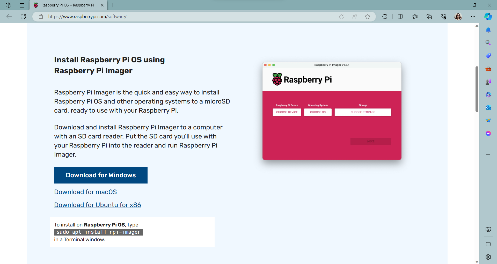
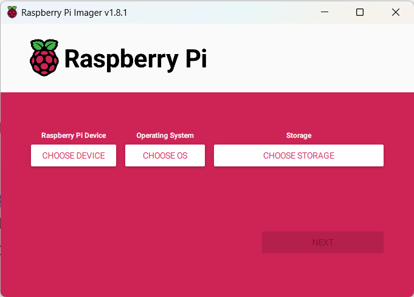
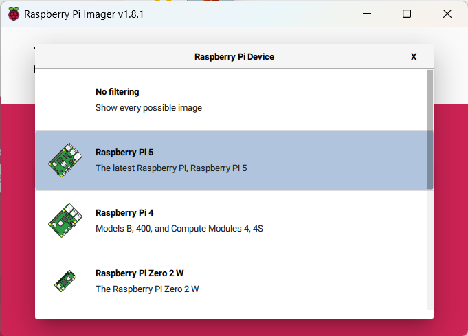
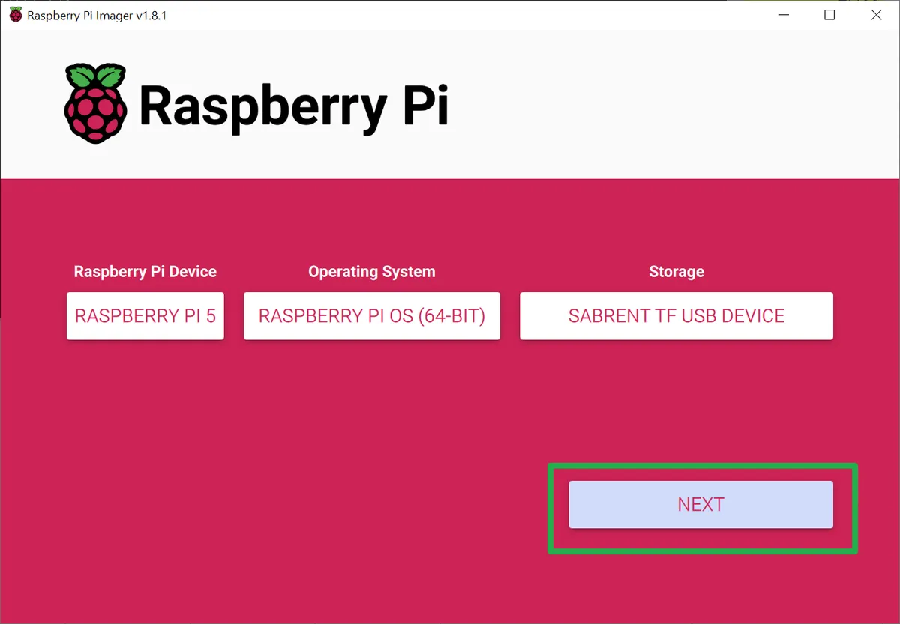
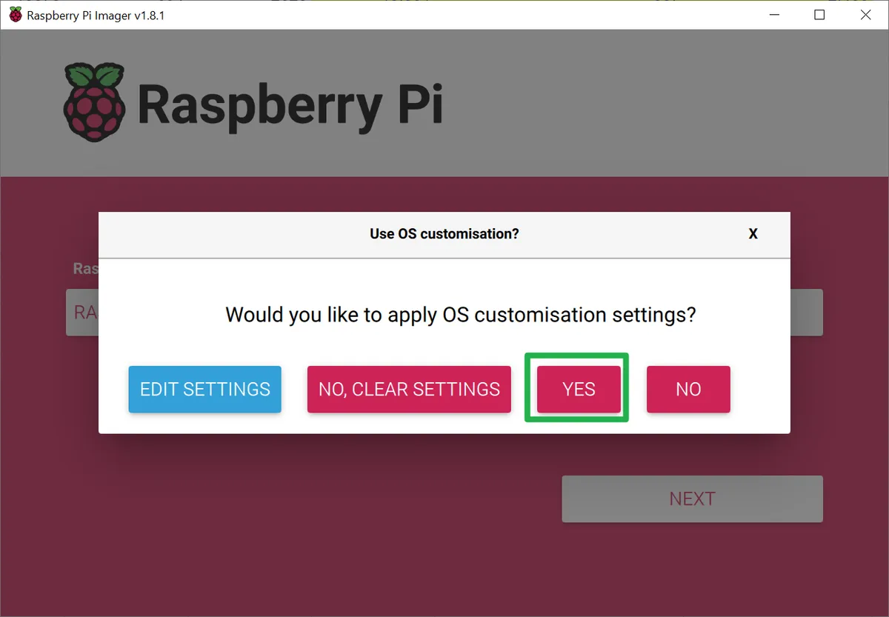

   
>### FINAL PROJECT IN INFORMATION ASSURANCE AND SECURITY
>Mirandilla, Johnlery | Morata, Marri Grace | Nobleza, Uriel Miguel | Pizzaro, Jesrel
# RASPBERRY PI INSTALLATION GUIDE

1. Prepare and Install Headless Raspbian OS in Raspberry Pi
   1. Insert a micro SD card that is 8GB or larger into your computer.
   
   2. Visit the [official Raspberry Pi website](https://www.raspberrypi.com/software/) then download, install, and run Raspberry Pi Imager.

       
      
   4. Choose which device, OS, and storage you are going to use.

      

      Upon clicking **CHOOSE DEVICE/OS/STORAGE**, a menu should appear. The picture below is an example.

      

   5. When done making your selection, proceed by clicking **NEXT**.

      

      _(Image credit: Tom's Hardware)_

   6. Click Edit Settings from the pop-up.

      

      _(Image credit: Tom's Hardware)_

   7. Fill in all the fields on the General tab.

      

      _(Image credit: CS3B Group 11)_
      
   8. On the Services tab, toggle **Enable SSH** to on and select **Use password authentication."**

      

      _(Image credit: CS3B Group 11)_

   9. Click **YES** to apply OS customization settings.

      

      _(Image credit: Tom's Hardware)_

   11. Click **YES** to confirm that you want to your microSD card and wait until the installation is done.

       
       
       _(Image credit: CS3B Group 11)_
       
       
       
       _(Image credit: CS3B Group 11)_

   13. Once OS is downloaded and written in your SD card, click **CONTINUE** then reomove your SD Card from your computer.

       

       _(Image credit: CS3B Group 11)_
   
2. Connecting to Raspberry Pi via SSH using the terminal

   1. Open _terminal_ and enter the following commands consecutively:
      **_ssh <username>@<hostname>_**

      

      _(Image credit: CS3B Group 11)_

      **_sudo apt update_**

      

      _(Image credit: CS3B Group 11)_

      **_sudo apt upgrade_**

      

      _(Image credit: CS3B Group 11)_

4. Deploying LAMP (Linux Apache MySQL PHP) Stack in raspberry Pi
   1. In the terminal, enter the following commands:
      **_sudo apt install apache2_**

      

      _(Image credit: CS3B Group 11)_

      **_sudo apt install mariadb-server_**

      
      
      _(Image credit: CS3B Group 11)_
      
      **_sudo mysql_secure_installation_**

      

      _(Image credit: CS3B Group 11)_

      **_sudo apt install php libapache2-mod-php php-mysql_**

      

      _(Image credit: CS3B Group 11)_
      
      **_sudo apt-get install php\*_**

      

      _(Image credit: CS3B Group 11)_
      
   2. You will be prompted to choose a web server. Select **apache2** using the spacebar, then press "Tab" to highlight **OK** and press Enter to continue.
      
      
      
      _(Image credit: CS3B Group 11)_
      
   3. Finally, enter this command on the terminal and wait until the process is complete: **_sudo apt install phpmyadmin_**

      
      
4. Enabling and controlling Rapberry Pi using VNC
   

(_**NOTE:** Images are not ours since we were able to perform the task before the announcement that there is a need for a documentation. Appropriate credits were noted after each photo. Thank you!_)
